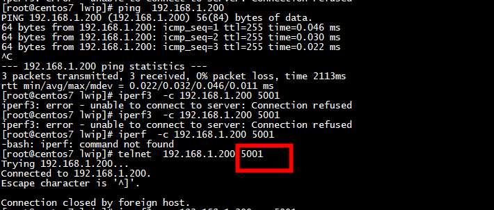
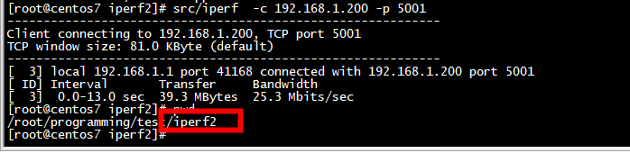
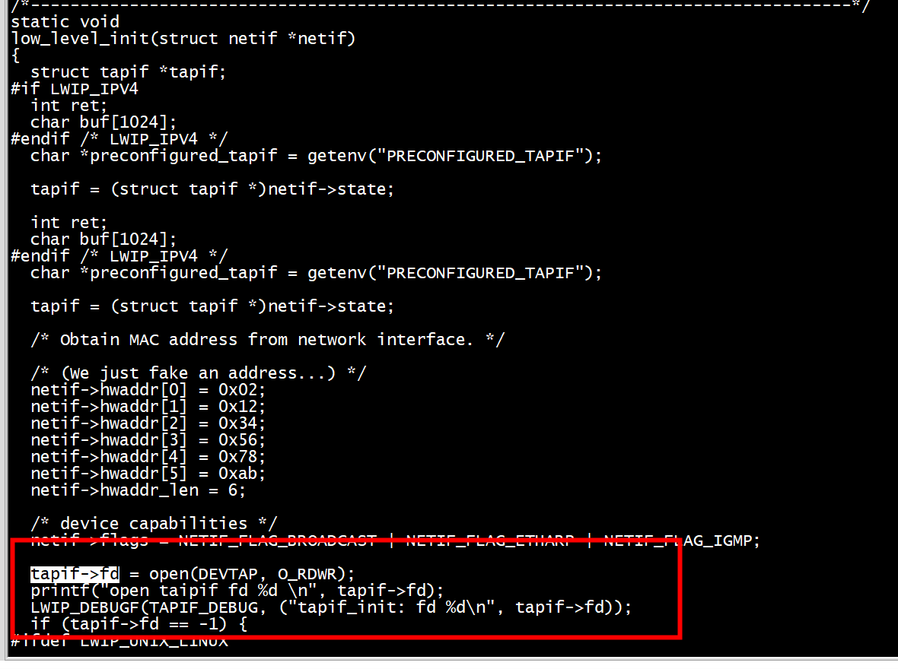

# make build

```
更改编译选项 Common.allports.mk
```

```
$ git clone https://github.com/lwip-tcpip/lwip.git
$ cd lwip
# 在 linux lwip默认使用 tap0 作为网络接口
$ sudo ./contrib/ports/unix/setup-tapif
$ cp ./contrib/examples/example_app/lwipcfg.h.example ./contrib/ports/unix/example_app/lwipcfg.h
$ cd ./contrib/ports/unix/example_app
$ vim lwipcfg.h # 去掉`#define USE_DHCP 0` 和`#define USE_AUTOIP 0`的注释，并将`LWIP_LWIPERF_APP`的宏定义为 1
$ mkdir build && cd build
$ cmake -DLWIP_DIR=/path/to/your/lwip/repo ..
$ make
$ sudo ./example_app
```

```
[root@centos7 build]# pwd
/root/programming/lwip/contrib/ports/unix/example_app/build
[root@centos7 build]# cmake -DLWIP_DIR=/root/programming/lwip/contrib/ports/unix/example_app/ ..
[root@centos7 example_app]# pwd
/root/programming/lwip/contrib/ports/unix/example_app
[root@centos7 example_app]#  make -j16
```

## 编译iperf2

***用iperf3 connect有问题***

```
git clone https://github.com/lynxis/iperf2.git
```

## run

***不需要网桥***

```
brctl delif lwipbridge  tap0
```





```
[root@centos7 ~]# ping 192.168.1.200
PING 192.168.1.200 (192.168.1.200) 56(84) bytes of data.
64 bytes from 192.168.1.200: icmp_seq=1 ttl=255 time=0.122 ms
64 bytes from 192.168.1.200: icmp_seq=2 ttl=255 time=0.110 ms
64 bytes from 192.168.1.200: icmp_seq=3 ttl=255 time=0.034 ms
^C
--- 192.168.1.200 ping statistics ---
3 packets transmitted, 3 received, 0% packet loss, time 2102ms
rtt min/avg/max/mdev = 0.034/0.088/0.122/0.040 ms
```

# tap


```
tap = open_tap(tap_name, IFF_TAP | IFF_NO_PI);
```



## make

```
[root@centos7 example_app]# pwd
/root/programming/lwip/contrib/ports/unix/example_app
[root@centos7 example_app]# make -j16
make -j16
```

```
[root@centos7 example_app]# ./example_app 
Starting lwIP, local interface IP is 192.168.1.200
ip6 linklocal address: FE80::12:34FF:FE56:78AB
status_callback==UP, local interface IP is 192.168.1.200
*******************tapif_input 
h_dest:33:33:00:00:00:16 
h_source:02:9b:99:37:4d:55 
h_proto:86dd
*******************tapif_input 
h_dest:33:33:00:00:00:16 
h_source:02:9b:99:37:4d:55 
h_proto:86dd
*******************tapif_input 
h_dest:33:33:00:00:00:16 
h_source:02:9b:99:37:4d:55 
h_proto:86dd
*******************tapif_input 
h_dest:33:33:00:00:00:16 
h_source:02:9b:99:37:4d:55 
h_proto:86dd
status_callback==UP, local interface IP is 192.168.1.200
*******************tapif_input 
h_dest:ff:ff:ff:ff:ff:ff 
h_source:02:9b:99:37:4d:55 
h_proto:0806
*******************tapif_input 
h_dest:02:12:34:56:78:ab 
h_source:02:9b:99:37:4d:55 
h_proto:0800
src ip:192.168.1.1
dest ip:192.168.1.200
*******************tapif_input 
h_dest:02:12:34:56:78:ab 
h_source:02:9b:99:37:4d:55 
h_proto:0800
src ip:192.168.1.1
dest ip:192.168.1.200
*******************tapif_input 
h_dest:02:12:34:56:78:ab 
h_source:02:9b:99:37:4d:55 
h_proto:0800
src ip:192.168.1.1
dest ip:192.168.1.200

```

```
static void
tapif_input(struct netif *netif)
{
  struct pbuf *p = low_level_input(netif);

#if TEST_TAP
  struct ethhdr *ethh ;
  struct iphdr *iph;
  unsigned char *src, *dst;
#endif
  if (p == NULL) {
#if LINK_STATS
    LINK_STATS_INC(link.recv);
#endif /* LINK_STATS */
    LWIP_DEBUGF(TAPIF_DEBUG, ("tapif_input: low_level_input returned NULL\n"));
    return;
  }

   printf("*******************tapif_input \n");
#if TEST_TAP
   ethh = (struct ethhdr*)(p->payload);
   printf("h_dest:%02x:%02x:%02x:%02x:%02x:%02x \n", MAC_ARG(ethh->h_dest));
   printf("h_source:%02x:%02x:%02x:%02x:%02x:%02x \n", MAC_ARG(ethh->h_source));
   printf("h_proto:%04x\n",ntohs(ethh->h_proto));
   if(0x0800 == ntohs(ethh->h_proto) )
   {
      iph = (struct iphdr *)((char *)p->payload + sizeof(struct ethhdr));
      src = (unsigned char *)&(iph->saddr);
      printf("src ip:%d.%d.%d.%d\n",IP_ARG(src));
      dst = (unsigned char *)&(iph->daddr);
      printf("dest ip:%d.%d.%d.%d\n",IP_ARG(dst));
   }
#endif
  if (netif->input(p, netif) != ERR_OK) {
    LWIP_DEBUGF(NETIF_DEBUG, ("tapif_input: netif input error\n"));
    pbuf_free(p);
  }
}
```